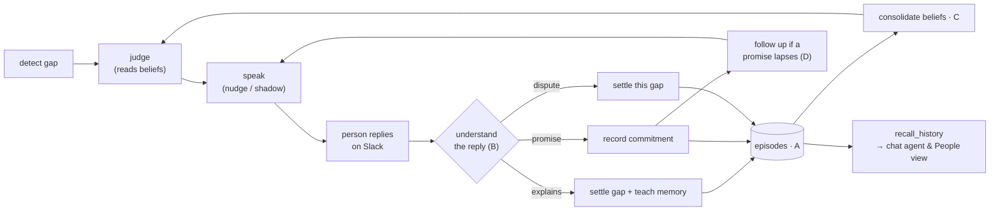

# The Memory Engine

> yoku doesn't just detect gaps — it **learns from what people tell it** and
> **follows through**. This document explains the memory engine: the four phases
> that turn yoku from a rule-counter into a teammate with a memory.

---

## Why this exists

The proactive engine ([`docs/yoku_agent.md`](yoku_agent.md)) detects cross-source
drift (a ticket marked Done with no PR, a PR merged with no ticket), judges
whether each gap is worth raising, and DMs the right person. That loop was
**stateless about people**: every sync it re-reasoned from scratch.

It had two kinds of memory:

- **Semantic memory** — `baselines`: per-person *statistics* ("92% of Priya's
  done tickets have no PR").
- **Procedural memory** — `person_memory.dismissals`: a *count* ("dismissed
  `done_no_pr` for Priya twice → stop raising it").

It had **no episodic memory** — no record of *what actually happened*. So when
someone replied to a nudge on Slack — *"we don't open PRs for spikes"* — that
reply was threaded onto the conversation and then **thrown away**. The single
richest signal about how a person works never taught yoku anything.

The memory engine closes that loop:

```
yoku nudges Priya about a Done ticket with no PR
   └─ Priya replies on Slack: "that's a spike, we don't open PRs for those"
        └─ yoku UNDERSTANDS the reply  → settles this gap, records the lesson
             └─ yoku CONSOLIDATES it into a belief (confidence 0.5, decays over time)
                  └─ next time a spike of Priya's looks like a gap → yoku stays quiet
   └─ or Priya replies: "good catch, I'll link it Friday"
        └─ yoku REMEMBERS the promise → chases it once if Friday passes
```

It is built in four additive phases (A→D), each a separate, independently
testable module. Nothing rips out the existing engine; each phase hooks into the
points where a real interaction already happens.

---

## The memory taxonomy

| Layer | What it holds | Where it lives | Built by |
|---|---|---|---|
| **Working** | within one sync run | in-process | (implicit) |
| **Episodic** | *what happened* — a timestamped interaction stream | `episodes` collection | **Phase A** |
| **Semantic** | generalizations about a person | `baselines` (stats) + `beliefs` (claims) | pre-existing + **Phase C** |
| **Procedural** | learned policies / suppression rules | `person_memory.dismissals` | pre-existing + fed by **Phase B** |

Phases B–D all stand on the **episodic** layer that Phase A introduces.

---

## Phase A — the episodic spine

**Module:** `yoku/proactive/episodes.py` · **Collection:** `episodes`

One row per concrete interaction. Five kinds:

| kind | recorded when | by |
|---|---|---|
| `sent` | yoku speaks (a real DM or a shadow-mode draft) | `orchestrator.run_proactive_loop` |
| `reply` | the person answers on Slack | `orchestrator.process_inbound_replies` |
| `dismissal` | a human clicks Dismiss in the Inbox | `signals.label_signal` |
| `confirm` | a human clicks Confirm in the Inbox | `signals.label_signal` |
| `followup` | yoku chases a lapsed commitment | `orchestrator.run_commitment_followups` |

**What makes it unique:** writes are **best-effort** — `record_episode` swallows
and logs its own errors so a memory-write failure can *never* break a human
action or the speak loop. It's capture-only: nothing reads episodes for decisions
in Phase A. And it's free — episodes accrue as side-effects of flows that already
run, so there's no new pipeline step.

**Example.** Priya is DM'd about `AS-4396`, then replies. Two episodes land:

```json
{ "kind": "sent",  "person_user_id": "u_priya", "signal_id": "sig1",
  "item_key": "jira/AS-4396", "detector": "done_no_pr", "source": "slack",
  "outcome": "sent", "text": "Hey Priya — AS-4396 is marked Done, but I can't find a PR…",
  "ts": "2026-06-13T09:00:00Z" }

{ "kind": "reply", "person_user_id": "u_priya", "signal_id": "sig1",
  "item_key": "jira/AS-4396", "detector": "done_no_pr", "source": "slack",
  "text": "that's a spike, we don't open PRs for those", "ts": "2026-06-13T09:12:00Z" }
```

---

## Phase B — reply understanding + commitments

**Module:** `yoku/proactive/reply_understanding.py`

A budgeted LLM tier (mirrors the judge: injectable `LlmFn` so tests never hit
OpenAI, an `understanding`-less episode queue, deferrals logged) reads each
`reply` episode and classifies it into one **outcome**, then *acts*:

| outcome | effect |
|---|---|
| `acknowledged` | enrich the episode only |
| `will_fix` / `promises` | record a **commitment** (`text`, `due`) on the signal; gap stays live |
| `disputes_gap` | settle *this* gap (item-specific) |
| `explains_as_normal` | settle this gap **and teach person memory** (general rule) |
| `question` / `other` | enrich only (a human may need to step in) |

**The two key design choices:**

1. **Suppression lands in the sticky `dismissed` state, not `resolved`.** The
   detector *reopens* a merely-`resolved` signal while the gap is still observed,
   so an explanation would re-nag next sync. Landing it in `dismissed`
   (resolution `explained`/`disputed`) makes it stick — the same mechanism a
   human Inbox dismissal uses.

2. **A general lesson is person-level, not signal-level.** When a reply
   `explains_as_normal`, the lesson reaches `person_memory` *even if the specific
   signal already self-healed* — "this is how I work" is item-independent and must
   survive. (`record_dismissal` feeds the judge's existing tier-1 counter; two
   such lessons suppress the whole pattern for that person.)

**What makes it unique:** this is the loop that was broken before. A reply in
*natural language* now (a) stops the current gap nagging and (b) makes future
similar gaps cheaper to suppress — and it works from a **single conversation**,
with no dependence on data volume.

**Example.** Priya's reply above is classified:

```json
{ "outcome": "explains_as_normal",
  "learned_pattern": "spikes/research tickets don't get PRs",
  "commitment": null, "reason": "team workflow" }
```

→ `sig1` becomes `dismissed` (resolution `explained`); a `dismissal` lands in
Priya's `person_memory` so the *next* spike suppresses cheaply.

Had she instead said *"good catch, I'll link it Friday"*:

```json
{ "outcome": "promises",
  "commitment": { "text": "link the PR", "due": "2026-06-19" }, "reason": "promised a fix" }
```

→ `sig1.commitment` is set; the gap stays live, awaiting Phase D.

---

## Phase C — consolidation + beliefs in the judge

**Module:** `yoku/proactive/beliefs.py` · **Collection:** `beliefs`

Raw episodes are distilled into durable **beliefs** — one claim per
`(person, gap-pattern)`, carrying a confidence the judge can reason with.

Evidence converges from three sources, recency-weighted:

| evidence | weight | direction |
|---|---|---|
| `explains_as_normal` reply | 1.0 | supports "normal" |
| `dismissal` | 0.6 | supports "normal" |
| `confirm` | 1.0 | **against** "normal" (it *was* a real gap) |

- **Decay is recency-weighting**, not a separate decrement pass: each piece of
  evidence counts `0.5 ** (age / 60 days)`, so a belief no longer reinforced
  fades on its own and the recompute stays idempotent.
- **Confidence saturates:** `net / (net + 1)` — one recent explanation → 0.50,
  three → 0.75; it never reaches 1.0, and a single weak signal (one dismissal →
  0.38) stays below the 0.40 floor so it never hardens into a "fact".
- **Atomic recompute:** beliefs are upserted by `(user_id, pattern)` and stale
  ones (not refreshed this run, tagged by a per-run token) are deleted — so a
  concurrent judge/Inbox read never catches the collection mid-wipe.

Then the payoff: the judge's **person dimension** (`judge._person_evidence`)
hands relevant beliefs to the LLM, and the prompt tells it to *defer to a
high-confidence belief that matches the gap*.

**What makes it unique:** this closes the loop that was *recorded but never read*.
Before, learned notes sat in `person_memory.patterns` and the judge never looked
at them. Now a reply Priya gave last week measurably shapes how the judge reasons
about the next gap. Crucially, beliefs are **evidence the LLM weighs, not a
unilateral suppressor** — the two-dimension AND-gate still decides, so a fuzzy
belief can't silence a genuinely unusual slip.

**Example.** After Priya's spike explanation, consolidation produces:

```json
{ "user_id": "u_priya", "pattern": "done_no_pr", "kind": "normal_workflow",
  "claim": "spikes/research tickets don't get PRs",
  "confidence": 0.5, "evidence_count": 1 }
```

Next sync, a new Done-with-no-PR spike of Priya's reaches the judge. The person
prompt now includes that belief → the model leans NORMAL → the AND-gate rejects
the gap → **yoku stays quiet**, without anyone clicking anything.

---

## Phase D — commitment follow-ups + reactive recall

**Module:** `yoku/proactive/orchestrator.py` (`run_commitment_followups`) and
`yoku/agent/tools/recall_history.py`

### Follow-ups
A promise captured in Phase B becomes `signal.commitment`. If the gap is still
live past the deadline (the explicit `due`, or `made_at` + a 2-day grace), yoku
sends **one** more gentle, specific chase that remembers what was promised.

- Only signals actually **sent** (a delivered DM) are chased — a shadow draft was
  never seen, so never followed up.
- It reuses the speak loop's guardrails: the same send keys, **the same per-person
  daily DM cap**, quiet hours, and a per-run budget. Bounded by `MAX_FOLLOWUPS=1`
  so it can never nag. A re-promise preserves the follow-up counter, so it can't
  be reset to dodge the cap.

**Example.** Friday passes and `AS-4396` still has no PR:

> *"Hey Priya — earlier you'd link the PR on AS-4396. Still on track, or want me
> to take it off your plate?"*

…sent once, recorded as a `followup` episode.

### Recall
`recall_history(person)` gives the **chat agent** a typed, person-resolved window
into the engine's memory — the interaction timeline, consolidated beliefs, and
open/settled commitments. The underlying collections stay off the `mongo_query`
whitelist (like `person_memory`), so access always goes through this tool.

**What makes it unique:** it bridges the **proactive ↔ reactive** halves, which
were siloed. You can now ask in chat:

> *"What have we flagged for Priya, and what's she on the hook for?"*

and get her nudges, her replies, what yoku has learned about her, and whether she
followed through on her promises — answered from the same memory the proactive
engine writes.

---

## The whole loop, end to end



---

## Where each piece lives

| Phase | Module | Collection(s) | Pipeline step |
|---|---|---|---|
| A | `proactive/episodes.py` | `episodes` | (side-effect of existing steps) |
| B | `proactive/reply_understanding.py` | reads `episodes`, writes `signals`, `person_memory` | `reply_understanding` |
| C | `proactive/beliefs.py` | `beliefs` | `beliefs` (before the judge) |
| D | `proactive/orchestrator.py`, `agent/tools/recall_history.py` | reads `signals`, writes `episodes` | `commitment_followups` |

Pipeline order (`pipeline/sync_service.py`):
`… → baselines → beliefs → detectors → judge → proactive_loop → reply_understanding → commitment_followups → metrics`.

## Safety properties

- **Best-effort everywhere** — memory writes never break a human action or the
  speak loop; every LLM tier is budgeted; Slack sends fall back to shadow.
- **Shadow by default** — follow-ups obey the same three send keys as nudges, so
  nothing reaches a real person until a tenant flips the go-live flag.
- **Tenant-isolated** — `episodes`/`beliefs` are per-tenant (one DB per tenant)
  and off the agent read whitelist.
- **Hermetically tested** — every phase has integration tests with an injected
  LLM; no test reaches OpenAI or Slack.

## Configuration

| Setting | Default | Controls |
|---|---|---|
| `reply_understanding_enabled` | `true` | Phase B LLM tier on/off |
| `reply_understanding_budget_per_run` | `20` | max replies parsed per sync |
| `commitment_followups_enabled` | `true` | Phase D follow-ups on/off |

(Belief weights, window, half-life, and confidence floor are tuned constants in
`beliefs.py`; follow-up grace and cap are constants in `orchestrator.py`.)
